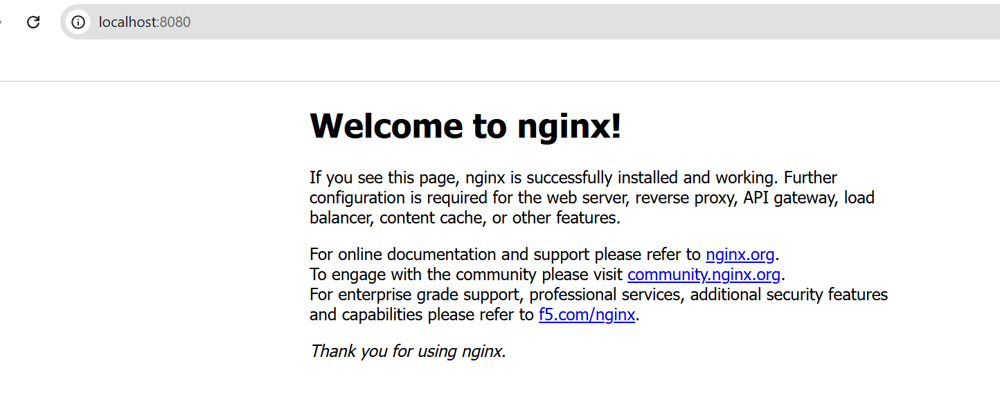
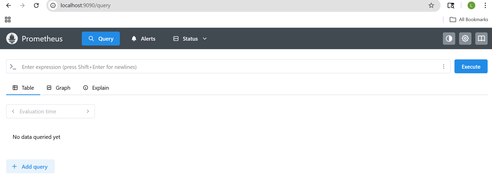
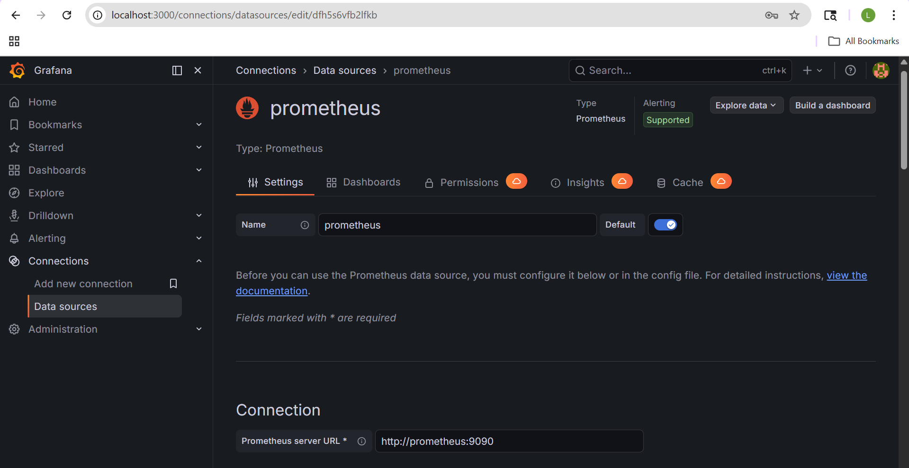

# Platform Engineering Lab

This project demonstrates building a mini platform engineering stack locally using Kubernetes and GitOps principles.

---

## Tech Stack

- Kubernetes (local cluster)
- Kind (Kubernetes in Docker)
- Docker Desktop
- kubectl

## Architecture
                         ┌────────────────────────────┐
                         │        👨‍💻 Developer        │
                         │   (Push code / YAML)       │
                         └────────────┬───────────────┘
                                      │
                                      ▼
                         ┌────────────────────────────┐
                         │        GitHub Repo         │
                         │  (K8s Manifests + IaC)     │
                         └────────────┬───────────────┘
                                      │
                          (GitOps via ArgoCD)
                                      │
                                      ▼
        ┌────────────────────────────────────────────────────────┐
        │              Kubernetes Cluster (Kind)                 │
        │                                                        │
        │  ┌──────────────────────┐       ┌────────────────────┐ │
        │  │   Nginx Deployment   │       │  Prometheus Deploy │ │
        │  │                      │       │                    │ │
        │  │   ┌──────────────┐   │       │  ┌──────────────┐ │ │
        │  │   │  Nginx Pod   │   │       │  │ Prometheus   │ │ │
        │  │   │              │   │       │  │    Pod       │ │ │
        │  │   └──────────────┘   │       │  └──────────────┘ │ │
        │  └─────────┬────────────┘       └─────────┬──────────┘ │
        │            │                              │            │
        │            ▼                              ▼            │
        │   ┌──────────────────┐         ┌──────────────────┐    │
        │   │ Nginx Service    │         │ Prometheus SVC   │    │
        │   │ (ClusterIP)      │         │ (ClusterIP)      │    │
        │   └────────┬─────────┘         └────────┬─────────┘    │
        │            │                              │            │
        │            │                              │            │
        │            ▼                              ▼            │
        │        (Traffic)                  (Metrics scrape)     │
        │                                                        │
        │                         ┌────────────────────┐         │
        │                         │ Grafana Deployment │         │
        │                         │                    │         │
        │                         │  ┌──────────────┐  │         │
        │                         │  │  Grafana Pod │  │         │
        │                         │  └──────────────┘  │         │
        │                         └─────────┬──────────┘         │
        │                                   │                    │
        │                                   ▼                    │
        │                          ┌──────────────────┐          │
        │                          │  Grafana SVC     │          │
        │                          │  (ClusterIP)     │          │
        │                          └────────┬─────────┘          │
        │                                   │                    │
        └───────────────────────────────────┼────────────────────┘
                                            │
                                            ▼
                                 ┌────────────────────┐
                                 │   Ingress /        │
                                 │   Port Forward     │
                                 └────────┬───────────┘
                                          │
                                          ▼
                                 ┌────────────────────┐
                                 │      🌐 User        │
                                 │   Browser Access   │
                                 └────────────────────┘

        ┌──────────────────────────────────────────────┐
        │             Terraform (IaC Layer)            │
        │                                              │
        │  - Provisions infra (future: cloud cluster)  │
        │  - Manages resources declaratively           │
        └──────────────────────────────────────────────┘

---

## Step 1: Install Prerequisites

### 1. Install Docker Desktop
Download and install Docker Desktop and ensure it is running.

### 2. Install kubectl
Verify installation 
 kubectl version --client

### 3. Install Kind

Download `kind.exe` and add it to PATH.

Verify:

    kind --version

---

## Step 2: Create Kubernetes Cluster

Create a local cluster using Kind:

    kind create cluster --name platform-lab

Verify cluster:

    kubectl get nodes

Expected output:

    platform-lab-control-plane Ready

Check system pods:

    kubectl get pods -A

---

## Step 3: Deploy First Application (nginx)

Create deployment:

    kubectl apply -f kubernetes/nginx-deployment.yaml

Verify:

    kubectl get deployments
    kubectl get pods

---

## Step 4: Expose the Application

Expose deployment as a service:

    kubectl apply -f kubernetes/nginx-service.yaml

Check service:

    kubectl get svc

---

## Step 5: Access the Application

Open in browser:

    http://localhost:8080

You should see the nginx welcome page.

## Step 6: Monitoring Stack
- Prometheus for metrics collection (running at port 9090)

- Grafana for visualization (running at 3000, prometheus connected as data source)
- Services exposed internally using ClusterIP
- Grafana connected to Prometheus via Kubernetes service DNS

## Step 7: Setup GitOps with ArgoCD
#### Install ArgoCD
  kubectl create namespace argocd
  kubectl apply --server-side --force-conflicts -n argocd -f https://raw.githubusercontent.com/argoproj/argo-cd/stable/manifests/install.yaml

#### Access ArgoCD UI

   kubectl port-forward svc/argocd-server -n argocd 8080:443

 Open: https://localhost:8080

## Step 8: Create GitOps Application
- Connect your GitHub repo in ArgoCD
- Create a new application:
  - Path: `kubernetes/`
  - Sync Policy: Automatic
